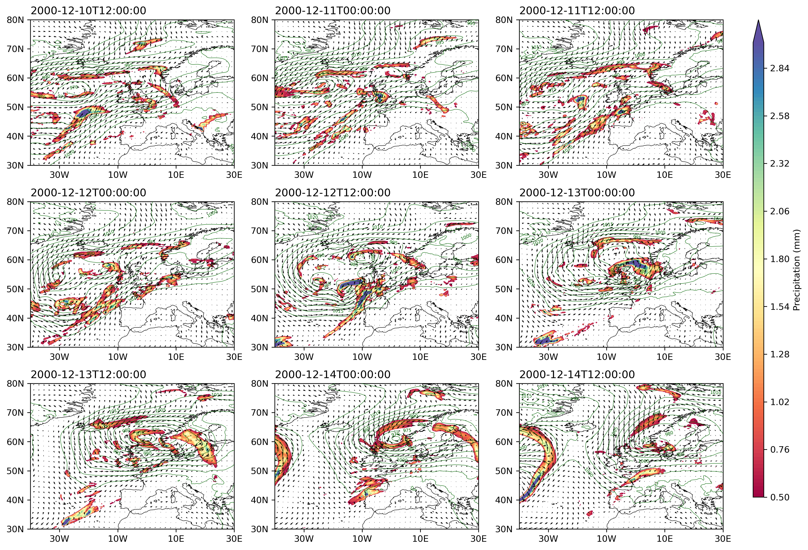
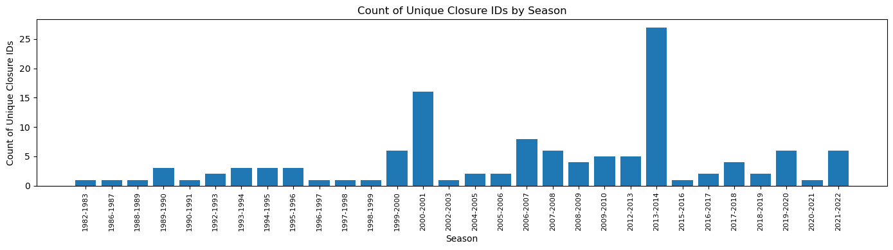
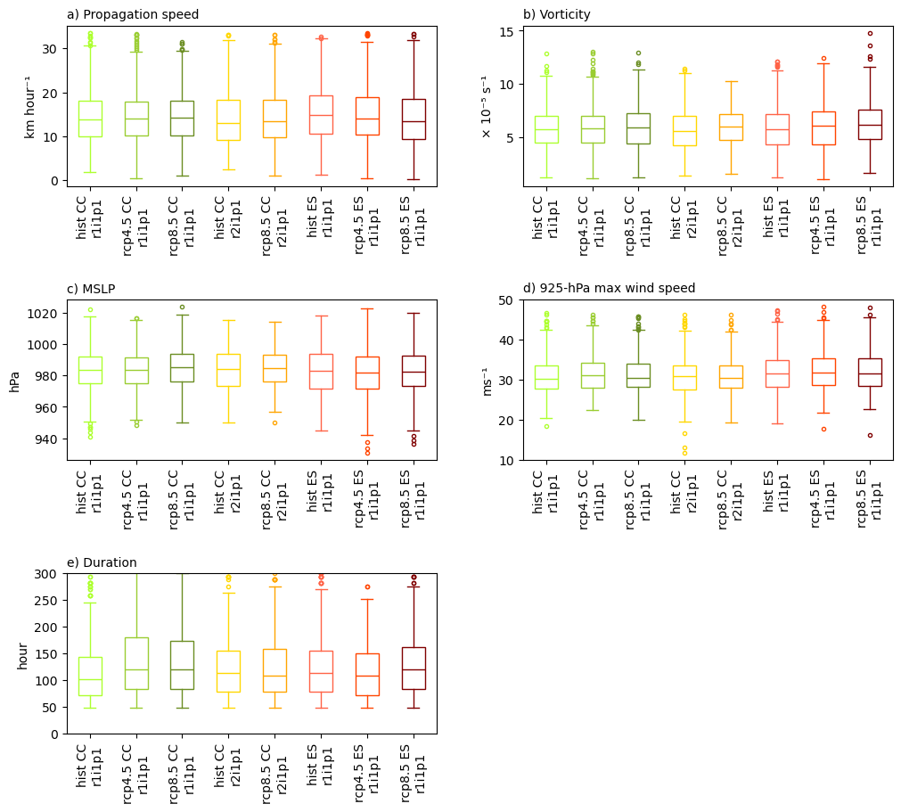

# North Sea Storms and Thames Barrier Closures

MSc research project, University of Reading, in partnership with Liberty Mutual Reinsurance.

## Question

Which North Sea storms are linked to Thames Barrier closures, what do those storms look like, and could they change under future climate?

## Data

Raw data is **not** included in this repository (it is large and some of it is licensed). Where to get it:

| Data | Source | Used for |
|---|---|---|
| ERA5 reanalysis (MSLP, winds, precipitation) | [Copernicus Climate Data Store](https://cds.climate.copernicus.eu/), downloaded with `cdsapi` | Storm tracks 1982-2022 and case-study maps |
| ERA5 / ERA-20C / C3S storm-track products | CDS and CEDA | Track comparison in notebook 01 |
| HadGEM2-CC and HadGEM2-ES CMIP5 storm tracks (historical, RCP4.5, RCP8.5) | Feature-tracked CMIP5 output in TRACK format | Future projections in notebook 03 |
| Thames Barrier closure dates, Sheerness tide levels, Kingston/Teddington river levels | Closure record supplied through the project; obtain tide and river data from the original providers | Closure matching in notebook 04 |

## Method

1. **Storm tracking.** Storms are tracked as 850 hPa relative vorticity features (`VOR850`) in ERA5 and in HadGEM2. Tracks are restricted to the North Sea region, with minimum-wind-speed and lifetime filters (see the `minwindspeed25_longlive` track files).
2. **Matching storms to closures.** Each closure date gets a window of -2 and +2 days. A storm is linked to a closure if its track is in the North Sea box (12W-12E, 45N-65N) inside that window.
3. **Closure types.** Closures are grouped as tidal, fluvial (river) or combined, using tide and river-level records.
4. **Future climate.** The same storm properties (speed, vorticity, MSLP, 925 hPa wind, duration, direction) are compared between HadGEM2 historical and RCP4.5/RCP8.5 runs, with ERA5 as the reference.

## Key findings

- 93 distinct storms were matched to 125 Thames Barrier closures across 30 winter seasons (1982-83 to 2021-22).
- Closures cluster in a few seasons: 27 in 2013-14 and 16 in 2000-01, against 1-8 in most others.
- Storm type differs by closure type. Mean storm MSLP is 977.6 hPa for fluvial, 979.3 hPa for combined and 982.4 hPa for tidal closures. Mean storm duration is about 4.4 days for fluvial and combined, and 5.2 days for tidal.
- In HadGEM2, storm speed, vorticity, MSLP and 925 hPa wind change little between historical and RCP runs. Storm duration shifts longer (median about 100 h in the historical run, about 120 h under RCP4.5 and RCP8.5 for HadGEM2-CC r1i1p1, read from the figure).

## Figures



*December 2000: MSLP contours, winds and precipitation, 10-14 December.*



*Thames Barrier closures matched to a storm, per winter season.*



*HadGEM2 storm properties in historical, RCP4.5 and RCP8.5 runs.*

## Why it matters for insurance

Thames Barrier closures mark periods when storm surge, tide and river flow together threaten London flood defences. Knowing which storm types drive closures, how often they cluster, and whether they could lengthen or intensify is an input to flood and surge scenario building and to judging how return periods may shift. This repository identifies the storm drivers and their frequency. It does not model flood damage or insured loss.

## How to run

```bash
python -m venv .venv && source .venv/bin/activate
pip install -r requirements.txt
```

1. Set up a CDS API key (`~/.cdsapirc`) to download ERA5 with `cdsapi`.
2. Put the downloaded and track files where the notebooks expect them (for example `Track/ERA5_VOR850_1hr_oct-mar{YYYY}{YYYY+1}_NORTHSEA_minwindspeed25_longlive.csv`).
3. Run the notebooks from the repository root, in order:

| Notebook | Content |
|---|---|
| `01_load_era5_storm_tracks.ipynb` | Read and filter ERA5 storm tracks; tide and river data; ERA20C and C3S track comparison; Xaver 2013 footprint |
| `02_historical_storm_climatology.ipynb` | North Sea storm climatology 1982-2022: frequency, direction, season storminess index |
| `03_cmip5_future_projections.ipynb` | HadGEM2 historical vs RCP4.5/RCP8.5, bias correction against ERA5 |
| `04_thames_barrier_closure_link.ipynb` | Matching storms to closures; tidal, fluvial and combined closure storms |

`extras/` holds side analyses (case studies for December 2000, February 2014 and March 2020, polar lows, and weather patterns on closure days). They use paths relative to the repository root.

Notebooks 02 and 04 were split out of one longer notebook and have not been re-run end to end since the split. Cells that raised errors had their error output removed; plots were kept.

## Credit

MSc project at the University of Reading, in partnership with Liberty Mutual Reinsurance. Contains modified Copernicus Climate Change Service information (ERA5).
